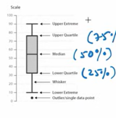
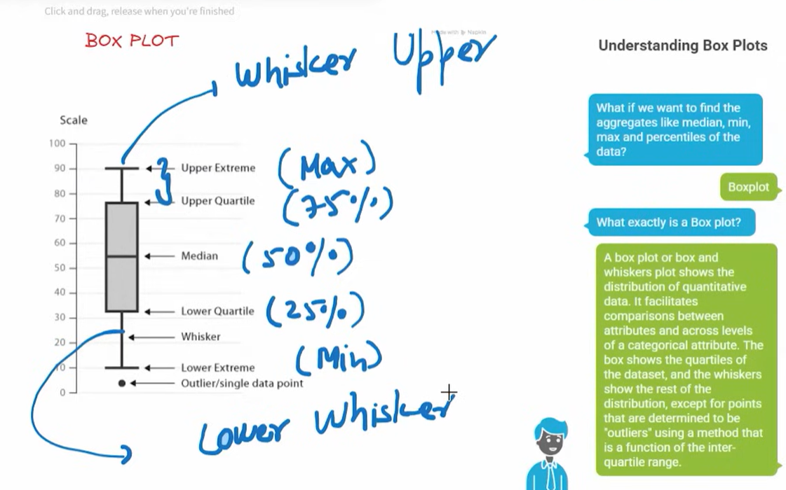

# Video Game Sales - Exploratory Data Analysis & Visualization

  
*(Example plot: Global Sales Distribution or Top Genres – replace with your favorite screenshot if needed)*

## Problem Statement
The video game industry is massive and highly competitive, with thousands of titles released each year. However, sales data often follows extreme distributions (a few blockbusters dominate, while most games sell modestly).  

**Objective**:  
Perform **Exploratory Data Analysis (EDA)** on historical video game sales data to:  
- Understand sales trends across genres, platforms, publishers, years, and regions  
- Identify patterns in global and regional performance  
- Uncover hidden/non-obvious insights, such as games that achieve high popularity/cultural impact despite relatively low or median sales  
- Visualize key distributions, correlations, and outliers to reveal industry dynamics (e.g., power-law in sales, regional preferences)  

This project demonstrates end-to-end data preprocessing, analysis, and storytelling through visualizations using Python's data stack.

## Dataset Source
- **Name**: Video Game Sales  
- **Source**: Kaggle – [https://www.kaggle.com/datasets/gregorut/videogamesales](https://www.kaggle.com/datasets/gregorut/videogamesales)  
- **Description**: Contains sales data for more than 16,500 video games (released before ~2016–2017), with sales > 100,000 copies. Columns include: Rank, Name, Platform, Year, Genre, Publisher, NA_Sales, EU_Sales, JP_Sales, Other_Sales, Global_Sales.  
- **License**: CC0: Public Domain (free to use)  
- **File used**: `vgsales.csv` (or similar – place it in the repo root if sharing data)

(If you used a different variant like one with critic scores or updated 2024 data, swap the link accordingly, e.g., https://www.kaggle.com/datasets/asaniczka/video-game-sales-2024)

## Key Insights Extracted
- **Power-Law Distribution in Sales**: Video game sales follow a heavy-tailed (Pareto-like) pattern. A tiny fraction of blockbuster games (e.g., Wii Sports, GTA V) account for massive revenue, while the **majority have low or median sales** (often < 0.5 million copies globally). Mean sales >> median due to extreme outliers.  
- **Low Sales but High Implied Popularity**: Some games show surprisingly low/median global sales despite cultural impact or niche popularity (e.g., cult classics, Japan-centric titles, or retro games with dedicated fanbases but limited mainstream reach). This highlights that sales figures alone don't capture true "success" or legacy.  
- **Regional Differences**: North America favors Action/Sports/Shooter genres; Japan strongly prefers Role-Playing; Europe shows more balanced tastes.  
- **Platform & Genre Dominance**: PS2, Xbox 360, Wii, and DS led in certain eras; Action, Sports, and Shooter genres consistently top global sales.  
- **Temporal Trends**: Sales peaked around 2005–2010 (console boom era); post-2010 decline in physical sales data (shift to digital not fully captured here).  
- **Outliers & Skewness**: Identified extreme high-sellers as outliers; used visualizations to show right-skewed distributions and the importance of log-scaling for analysis.

## Techniques Used
- **Data Preprocessing** (Pandas & NumPy):  
  - Loaded & inspected data  
  - Handled missing values (e.g., Year, Publisher)  
  - Converted data types, filtered outliers if needed  
  - Created derived features (e.g., total regional sales checks)  

- **Exploratory Data Analysis & Visualization** (Matplotlib + Seaborn):  
  - Histograms & boxplots to reveal sales skewness (e.g., `seaborn.boxplot` on Global_Sales to highlight heavy right tail and low median)  
  - Bar plots / count plots for top genres, platforms, publishers  
  - Heatmaps for correlations (e.g., regional sales)  
  - Line plots for sales trends over years  
  - Scatter plots or pairplots to explore relationships (e.g., sales vs. implied popularity proxies)  
  - Identified outliers/low-sales-high-impact games via filtering + manual inspection  

- Notebook: Main analysis in `matplot.ipynb`  
- Saved figures: `image.png`, `image-1.png`, etc. (embedded below or view in repo)

## Visual Highlights
Here are some key plots from the analysis:

  
*Seaborn boxplot showing extreme skewness in Global_Sales – most games cluster at low values, with huge outliers*

  
*Bar chart of top-selling genres – Action and Sports dominate*

(Add more embeds like this for your other images – just copy the filename from your repo)

## How to Run
1. Clone the repo: `git clone https://github.com/Manmohan-Shukla/data-visualisation.git`  
2. Download the dataset from Kaggle link above  
3. Install requirements: `pip install pandas numpy matplotlib seaborn`  
4. Open `matplot.ipynb` in Jupyter Notebook / Jupyter Lab / VS Code  
5. Run all cells  

## Future Improvements
- Add statistical tests (e.g., correlation significance)  
- Include critic/user scores if extending dataset  
- Build interactive dashboards (Plotly / Streamlit)  
- Predict sales trends (move to ML models)

Feel free to ⭐ the repo if you find it useful!

Made by: Manmohan Shukla  
